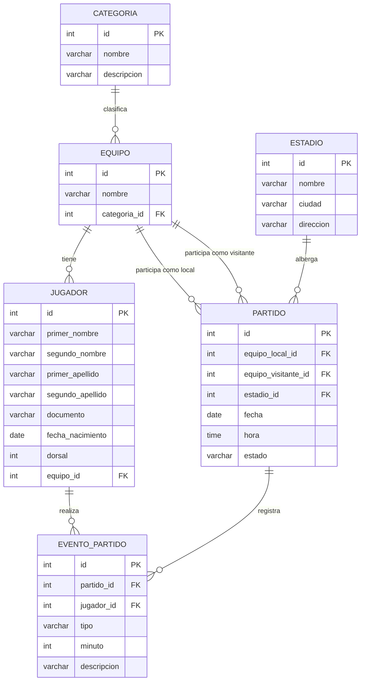

# Modelo Entidad-Relación - LeagueMaster Pro

## MER normalizado hasta Tercera Forma Normal (3FN)

## Entidades identificadas

1. Categoria
2. Equipo
3. Jugador
4. Estadio
5. Partido
6. EventoPartido